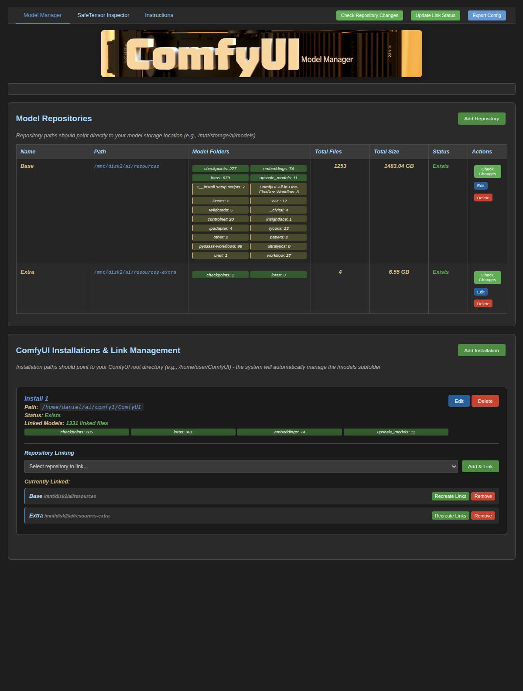
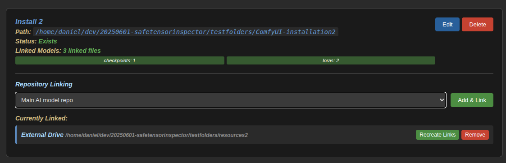
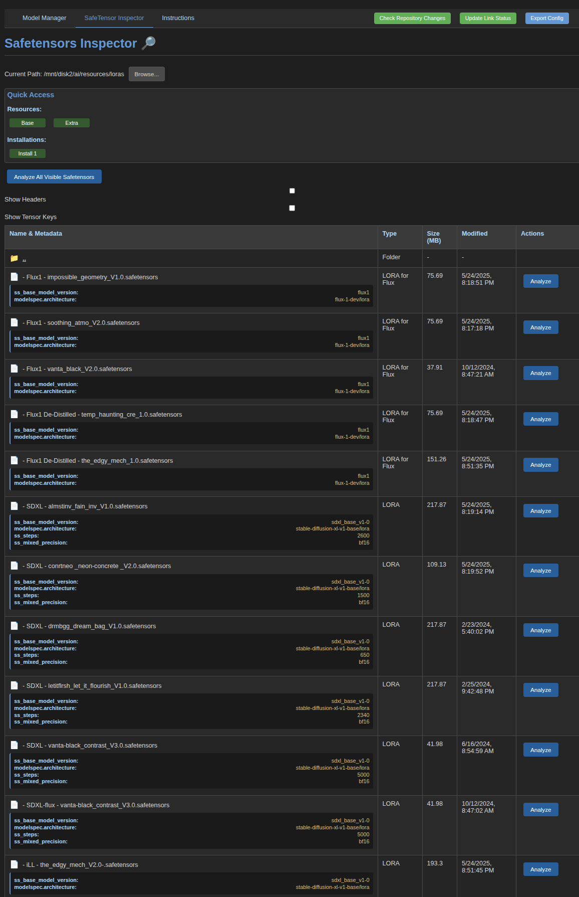

# ComfyUI Model Manager & SafeTensor Inspector 🎨🔍

A comprehensive web-based tool that combines **model ecosystem management** with **deep SafeTensor analysis**. Eliminate model file duplication across multiple ComfyUI installations while providing powerful model inspection capabilities.



## ✨ Key Features

### 🗂️ **Model Manager**
- **Repository Management**: Organize models in centralized repositories
- **Installation Tracking**: Manage multiple ComfyUI installations  
- **Smart Linking**: Automatic symbolic link creation and management
- **Path Validation**: Real-time path existence checking
- **Change Detection**: Monitor repository changes and file counts

### 🔍 **SafeTensor Inspector** (Integrated)
- **Metadata Analysis**: Extract comprehensive SafeTensor file information
- **Quick Access**: Navigate instantly to any repository or installation
- **Batch Processing**: Analyze multiple files simultaneously
- **Detailed Inspection**: View tensor keys, headers, and model parameters
- **Path Browsing**: Built-in file system navigation

### 🔗 **Unified Experience**
- **Single Interface**: Access both tools from one modern web UI
- **Seamless Navigation**: Click from management to inspection instantly
- **System Actions**: Quick access to all management functions
- **Visual Design**: Professional dark theme with intuitive layout

## 🏗️ Architecture

### Repository Structure
Your centralized model storage locations:
```
/mnt/storage/ai/models/
├── checkpoints/
├── loras/
├── embeddings/
├── controlnets/
├── vae/
└── upscale_models/
```

### ComfyUI Installation Structure  
Your ComfyUI installations (tool manages the models subfolder):
```
/home/user/ComfyUI/
├── models/          ← Tool creates symbolic links here
│   ├── checkpoints/ → /mnt/storage/ai/models/checkpoints/
│   ├── loras/       → /mnt/storage/ai/models/loras/
│   └── ...
├── web/
├── comfy/
└── main.py
```

## 🚀 Quick Start

### Linux/macOS Setup
```bash
chmod +x setup.sh
./setup.sh
chmod +x start_model_manager.sh
./start_model_manager.sh
```

### Windows Setup
```batch
setup.bat
start_model_manager.bat
```

### Configuration
Copy the example configuration and customize for your setup:

**Linux/macOS:**
```bash
cp model_manager_config.example.json model_manager_config.json
```

**Windows:**
```batch
copy model_manager_config.example.json model_manager_config.json
```

Then edit `model_manager_config.json` with your actual paths.

### Access Application
Navigate to: **http://localhost:8002**

## 📖 Getting Started - 3 Simple Steps

### Step 1: Add Your Model Repositories 📚
Set up your central model storage locations - where your actual files live.


**Example**: `/mnt/storage/ai/models`
- Contains your actual model files (.safetensors, .ckpt, etc.)
- Organized in standard ComfyUI folder structure

### Step 2: Add Your ComfyUI Installations 🖥️
Register each ComfyUI installation that should access shared models.


**Example**: `/home/user/ComfyUI`
- Point to ComfyUI root directory
- Tool automatically manages the models subfolder

### Step 3: Link Repositories to Installations 🔗
Connect repositories to installations to create symbolic links.



**Result**:
- Repository folders → ComfyUI model folders
- Automatic symbolic link creation
- Status monitoring and health checks

## 🔍 SafeTensor Inspector

### Quick Access Shortcuts


Instantly navigate to any repository or installation with one click.

### Advanced Metadata Analysis


Extract comprehensive information from SafeTensor files:
- **Key Parameters**: Base model, steps, precision
- **Full Headers**: Complete metadata inspection  
- **Tensor Keys**: Detailed tensor structure
- **Batch Analysis**: Process multiple files at once

## ⚙️ Configuration

The application stores configuration in `model_manager_config.json`:

```json
{
  "repositories": [
    {
      "id": 1,
      "name": "Main Models",
      "path": "/mnt/storage/ai/models",
      "description": "Primary model collection",
      "exists": true
    }
  ],
  "comfyui_installations": [
    {
      "id": 1, 
      "name": "ComfyUI Main",
      "path": "/home/user/ComfyUI",
      "description": "Main installation",
      "exists": true
    }
  ],
  "links": {
    "1": [1]
  }
}
```

## 🔧 System Actions

Available from the top navigation bar:

- **Check Repository Changes**: Scan for new/modified files
- **Update Link Status**: Refresh all symbolic link health
- **Export Config**: Backup your configuration

## 🌟 Benefits

### ✅ **Eliminate Duplication**
- Store models once, access from multiple ComfyUI installations
- Save disk space and reduce sync overhead
- Centralized model management

### 🔗 **Smart Linking** 
- Automatic symbolic link creation and management
- Real-time status monitoring
- Easy recreation if links break

### 📊 **Comprehensive Analysis**
- Deep SafeTensor metadata inspection
- Quick navigation between management and analysis
- Batch processing capabilities

### 🗂️ **Easy Organization**
- Visual interface for all operations
- Path validation and existence checking
- Change detection and monitoring

## 🛠️ Technical Details

### Built With
- **Backend**: Python HTTP server with REST API
- **Frontend**: Modern HTML/CSS/JavaScript
- **Storage**: JSON-based configuration
- **Security**: Filesystem access restrictions

### Ports
- **Model Manager**: http://localhost:8002
- **Integrated SafeTensor Inspector**: Same interface

### API Endpoints
- Repository CRUD: `/api/repositories`
- Installation CRUD: `/api/installations` 
- Link Management: `/api/link`, `/api/unlink`
- File System: `/api/browse`, `/api/analyze_file`
- Utilities: `/api/check_path`, `/api/update_link_status`

## 🐛 Troubleshooting

### Common Issues

**"Path does not exist"**
- Verify path is typed correctly
- Check if directory is mounted
- Ensure read permissions

**"Port already in use"**
- Application uses port 8002
- Stop other services on this port
- Or modify the port in `start_model_manager.sh`

**"Virtual environment not found"**
- Run `./setup.sh` first
- Ensure you're in the project directory

**"Cannot create symbolic links"**
- **Linux/macOS**: Check filesystem permissions and user privileges
- **Windows**: Run as Administrator OR enable Developer Mode:
  - Settings → Update & Security → For developers → Developer Mode: ON
  - Or right-click batch files and "Run as administrator"
- Ensure target directories exist

## 💡 Best Practices

### Repository Organization
- Use descriptive names: "SDXL Models", "LoRA Collection"
- Separate model types if needed
- Keep consistent path patterns

### Installation Management  
- Name by purpose: "ComfyUI-Main", "ComfyUI-Testing"
- Use different installations for stability vs experimentation
- Document differences in descriptions

### Linking Strategy
- Link stable repositories to main installations
- Use experimental repositories only for test setups
- Multiple repositories per installation for organization

## 🔄 Workflow Example

1. **Setup repositories**: 
   - "Main Models" → `/mnt/storage/ai/models`
   - "Experimental" → `/mnt/storage/ai/experimental`

2. **Add installations**:
   - "ComfyUI Main" → `/home/user/ComfyUI`
   - "ComfyUI Test" → `/home/user/ComfyUI-test`

3. **Link strategically**:
   - Main installation ← Main Models repository
   - Test installation ← Both repositories

4. **Inspect and analyze**:
   - Use SafeTensor Inspector tab for detailed analysis
   - Quick Access shortcuts for instant navigation
   - Batch analyze new model files

This creates a robust, scalable system for managing complex ComfyUI setups! 🎉

## 📝 Requirements

See `requirements.txt`:
```
flask
waitress
safetensors
```

## 🤝 Contributing

This tool evolved from a simple SafeTensor Inspector into a comprehensive model management system. Feel free to contribute improvements or extensions!

## 📄 License

Open source - feel free to modify and distribute. 