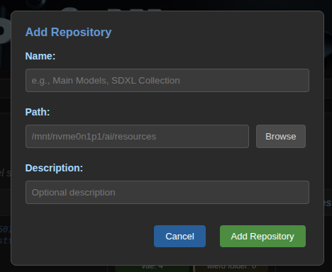

# ComfyUI Model Manager
A simple tool that combines **model repos**, **comfyUI installs** and **safeTensor inspector**. 

## Model repos and ComfyUI
This tools makes it handy to manage models of any kind of different architectures. FLUX, SDXL, SD1.5, Stable cascade. 
With a few clicks you can change comfyUI to only show FLUX or SDXL or SD1.5 or any way of sorting your models. 
There are folders that holds the models, i.e. **models repos**. 
There are folders that holds ComfyUI installation, i.e. **ComfyUI Installs**.
This model manager can link them in any combination. Run this tool to do the config. No need to keep it running. The models will still be available. :)

## Safetensor inspector
Need help understanding all those .safetensor in /download that you downloaded bcoz there was a picture mas with this checkpoint/lora/whatever files?
All those downloaded .safesonsor files. Do you need help sorting them? Is it a SD1.5 checkpoint? Or was it a FLUX LORA? Maybe it was a contolnet!
Use the **safeTensor inspector** to find out. Basic type and architecture is always shown if found. Base model, architecture, steps, precision (bf16, bf8, ...) is always shows. 
Author, number of steps trained and lots of other data can be found in the headers and keys. 


## Storage Architecture / Folder structure

### Repository Structure
You can organize your model repositories in different ways depending on your needs:

#### Option 1: By Model Architecture
Create separate repositories for different model architectures. This keeps models organized by compatibility and makes it easy to link only relevant models to specific ComfyUI installations.

```
/mnt/storage/ai/models-flux/
├── checkpoints/
├── loras/
├── embeddings/
├── controlnet/
├── vae/
└── upscale_models/

/mnt/storage/ai/models-sdxl/
├── checkpoints/
├── loras/
├── embeddings/
├── controlnet/
├── vae/
└── upscale_models/

/mnt/storage/ai/models-sd15/
├── checkpoints/
├── loras/
├── embeddings/
├── controlnet/
├── vae/
└── upscale_models/
```

#### Option 2: By Content Style/Purpose
Organize repositories by the type of content or artistic style. This approach is useful when you have specialized workflows or want to keep certain model collections separate.

```
/mnt/storage/ai/models-cartoons/
├── checkpoints/
├── loras/
├── embeddings/
├── controlnet/
├── vae/
└── upscale_models/

/mnt/storage/ai/models-photos/
├── checkpoints/
├── loras/
├── embeddings/
├── controlnet/
├── vae/
└── upscale_models/

/mnt/storage/ai/models-paintings/
├── checkpoints/
├── loras/
├── embeddings/
├── controlnet/
├── vae/
└── upscale_models/
```

#### Option 3: Mixed Approach
If you are really nerdy, combine both approaches - organize by architecture first, then by content within each architecture:

```
/mnt/storage/ai/flux-models/
├── realistic/
│   ├── checkpoints/
│   └── loras/
├── anime/
│   ├── checkpoints/
│   └── loras/
└── artistic/
    ├── checkpoints/
    └── loras/
```

### ComfyUI Installation Structure  
This is the standard, ComfyUI installation structure. The tool manages the models subfolders:
```
/home/user/ComfyUI/
├── models/          ← Tool creates symbolic links here
│   ├── checkpoints/ → /mnt/storage/ai/models/checkpoints/
│   ├── loras/       → /mnt/storage/ai/models/loras/
│   └── ...
├── web/
├── comfy/
└── main.py
```

## Setup / Installation

### Linux/macOS Setup
```bash
chmod +x setup.sh
./setup.sh
chmod +x start_model_manager.sh
./start_model_manager.sh
```

### Windows Setup
```batch
setup.bat
start_model_manager.bat
```

### Configuration
Copy the example configuration and customize for your setup:

**Linux/macOS:**
```bash
cp model_manager_config.example.json model_manager_config.json
```

**Windows:**
```batch
copy model_manager_config.example.json model_manager_config.json
```

Then edit `model_manager_config.json` with your actual paths.

### Access Application
Navigate to: **http://localhost:8002**

## Getting Started - 3 Simple Steps

### Step 1: Add Your Model Repositories 📚
Set up your central model storage locations - where your actual files live.



**Example**: `/mnt/storage/ai/models`
- Contains your actual model files (.safetensors, .ckpt, etc.)
- Organized in standard ComfyUI folder structure

### Step 2: Add Your ComfyUI Installations 🖥️
Register each ComfyUI installation that should access shared models.


**Example**: `/home/user/ComfyUI`
- Point to ComfyUI root directory
- Tool automatically manages the models subfolder

### Step 3: Link Repositories to Installations 🔗
Connect repositories to installations to create symbolic links.


**Result**:
- Repository folders → ComfyUI model folders
- Automatic symbolic link creation
- Status monitoring and health checks

## SafeTensor Inspector

This is where the project started, it was just downhill from there. 

### Quick Access Shortcuts


Instantly navigate to any repository or installation with one click.

### Advanced Metadata Analysis


Extract comprehensive information from SafeTensor files:
- **Key Parameters**: Base model, steps, precision
- **Full Headers**: Complete metadata inspection  
- **Tensor Keys**: Detailed tensor structure

## Benefits

### **Eliminate Duplication**
- Store models once, access from multiple ComfyUI installations
- Save disk space and reduce sync overhead

### **Smart Linking** 
- Automatic symbolic link creation and management
- Easy recreation if links breaks, for example after reboots

### **Comprehensive Analysis**
- Deep SafeTensor metadata inspection
- Quick navigation between management and analysis

### **Easy Organization**
- Visual interface for all operations

Daniel 2025
